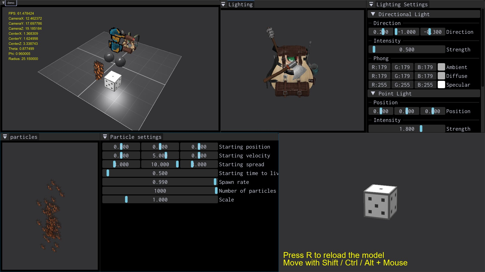
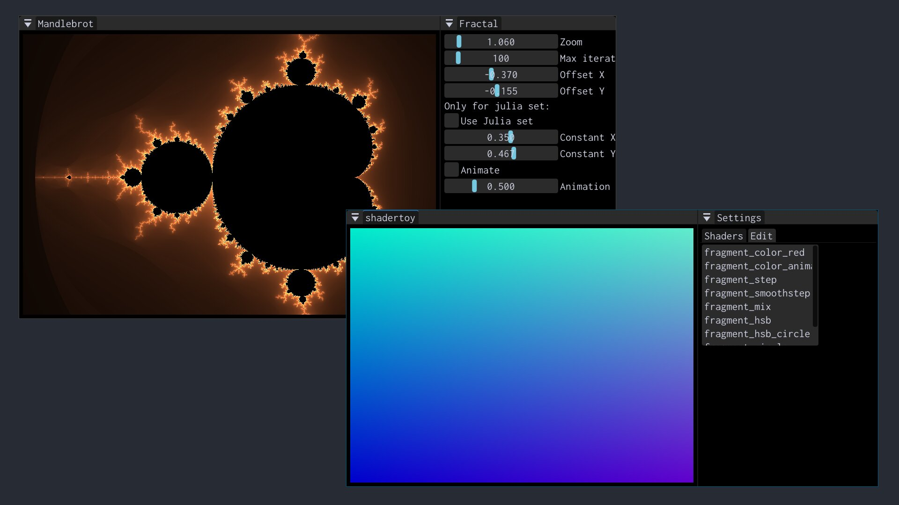

**Brenta Engine** is a simple 3D engine written in modern C++/OpenGL
using a hybrid scene-graph and Entity Component System
architecture. The engine was created by Giovanni Santini in the summer
of 2024, the name is inspired by the Brenta Dolimites in the Italian
Alps.

Check out [GUIDE.md](./docs/GUIDE.md) for a quick introduction on how
the engine works, and [DESIGN.md](./docs/DESIGN.md) for an overview of
the engine's internals.

<h2 align=center>  Features </h2>

The engine is composed of many subsystems like `Window`, `Input`,
`Audio`, `Engine`, `Logger`, `Ecs` as well as custom opengl RAII
objects and many abstractions to work with 3D graphics. It also
supports:

- hot reloading
- GPU particles
- loading TrueType fonts, textures, audio and .obj meshes
- central asset management
- scene graph
- ECS
- lua node scripting
- GUI using ImGui
- signals
- point and directional lights
- input management with callbacks

To get a detailed look at the engine, please visit the
[website](https://san7o.github.io/Brenta-Engine/) and code
[documentation](https://san7o.github.io/Brenta-Engine/annotated.html).

The engine also features the following sub projects:

- [oak](https://github.com/San7o/oak): feature-rich, thread-safe, Brenta Engine's logger.
- [viotecs](https://github.com/San7o/viotecs): the engine's official ECS.
- [tenno](https://github.com/San7o/tenno-tl): custom standard library
- [valFuzz](https://github.com/San7o/valFuzz): multi-threaded testing and fuzzing library for the engine.
- [san7o.github.io/Brenta-Engine/](https://san7o.github.io/Brenta-Engine/): html website

<h1 align=center> Screenshots </h1>

  
  

<h1 align=center> Building </h1>

All instructions to build the demo game are in [BUILD](./docs/BUILD.md),
there are also instructions on how to [build unit tests](./tests/README.md)
and how to [build examples](./examples/README.md).

The engine is licensed under [MIT](./LICENSE) license.
