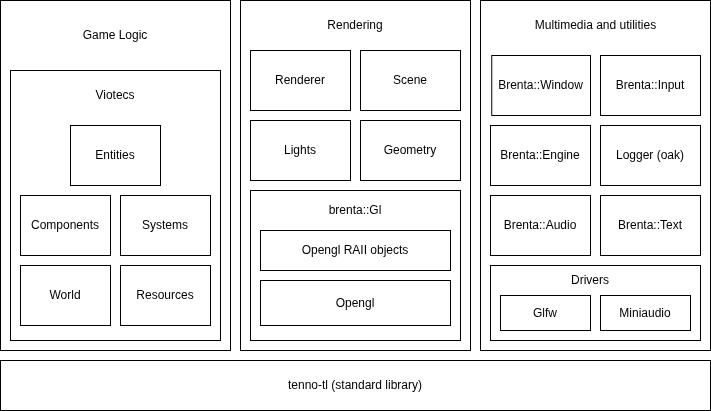
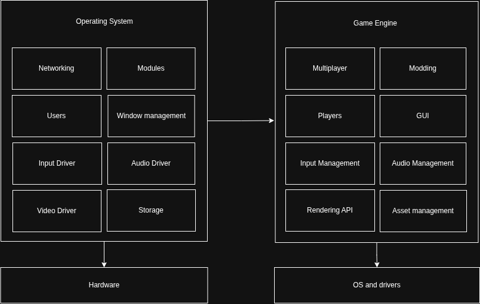
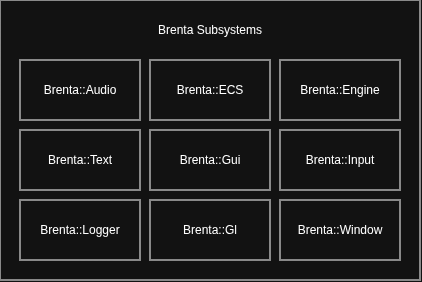
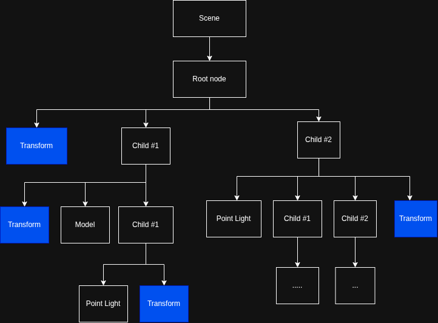

# Design

THIS DOCUMENT IS A DRAFT AND IT IS NOT COMPLETE

What is a game engine?

The line between a game / application and its engine is not something
inherently fixed, people have different needs and they may think
differently about it. This is what fundamentally drives the design of
their engines. AAA studios may want a "big engine" that provides many
advanced features out of the box, I would place Unreal Engine and
Unity in this category. Some other smaller studios or individual
recreational programmers may want a lighter platform that is easier to
understand and to modify, think Raylib and Love2D.

Regardless, game engines are usually complex pieces of software. They
provide an platform to define logic, render graphics, and access
system resources like audio and input, as well as providing a
cross-platform abstraction to the developer.

Brenta-Engine is more positioned towards the "big-engine"
category. Here is an high level overview of the major classes that are
used in the engine:

## Design proces

Brenta's development has been more iterative than meticulously
designed. I rewrote huge parts of the engine many many times, to the
point where I am not scared to do big refactoring anymore - that is
just routine - and I know I am deemed to repeat this process
again. But through these many refactoring, the API reached a point
where all objects work well together and you can reason about them
through what I call the "architecture" or "design" of the engine. This
is what I aim to describe in this documents.

I wanted to write my own graphics engine primarily because I was
curious to understand how these big systems are designed and
implemented, and as a programming exercise / learning experience. The
more I learned about graphics the more I became fascinated and
interested in the topic.

When I began this project in July 2024 I was really confused with
using OpenGL and C++, it took me a while to develop a decent mental
model. I was at my second year of university and I did not have any
major programming experience, but I pushed through it and hacked some
things. I became obsessed with the project for the entire summer,
which led to the release of Brenta v1.0.0. I did not fully understand
what I was doing and its design is more of a hack (and the code
clearly shows it). I moved on to other projects afterwards.

I picked up the project in December 2025, I was a more experienced
developer and I took up the challenge again. Here I fully rewrote
every part of the engine, introducing most of the core abstractions
that the engine uses. I found out that writing a game engine has a lot
of overlap with writing an operating system (which is another area I
am really interested in). You are working with audio, files, video,
network and the GPU. A game engine is essentially a realtime system
since you need to compute logic and render the frame in under 16ms to
run at 60 FPS, hence you have to understand how the CPU and memory
works in order to optimize it.

## Subsystems

One of the first architectural decision I made was the introduction of
the `Sybsystem`. Brenta engine is divided in subsystems, each one has
different responsibilities and provides certain abstractions. The most
important subsystems are the Rendering, which manages things like the
scene and render commands, and the Entity Component System (ECS) which
manages game logic.

## Renderer

The renderer provides a set of abstraction for working with geometry
and lights in order to render a frame on the screen (or to a
framebuffer).

The actual rendering algorithm deserves its own book. There are many
rendering techniques available, the most popular ones are
rasterization which is common in realtime rendering, and ray tracing
which is powerful but slower so it is often used for offline rendering
(but modern GPUs now provide raytracing support on hardware to speed
this up).  Brenta uses rasterization, which means projecting each
surface to the screen and calculating the color of each pixel by
interpolating each one of them (parallelized on the GPU).

This "projection" is achieved by multiplying together three matrices:
the `model` or `world` matrix which translates a vertex to its
position in world space, the `view` matrix which shift and rotates the
world based on the camera position (If the camera moves 5 feet to the
right, it’s mathematically the same as moving the entire world 5 feet
to the left), and `projection` matrix which applies perspective and
field-of-view; this ultimately maps the vertices inside a cube called
the Canonical Cube where the GPU can work with.

Another huge topic is lighting. Brenta implements the [Phong
reflection
model](https://en.wikipedia.org/wiki/Phong_reflection_model) but
provides the abstractions necessary to integrate other methods.

## Scene

There are many ways to define a scene. Brenta supports both the
node-graph architecture, commonly used in Godot, Unity and Unreal,
and the ECS (Entity Component System) architecture like in
[Bevy](https://github.com/bevyengine/bevy/).

### Node graph

The scene is a tree of nodes where each node has a transform, and may
have a model, a directional light, any number of point lights and
other nodes (children). All transforms are relative to the transform
of their parent; when a node is updated, all its children are updated
too.

Here is an high-level picture that shows the main classes used in the
scene graph, where arrows going down mean the parent contains one or
more children:

### Ecs

The Entity Component System architecture is used to manage all logic
of a videogame. Check out [viotecs](https://github.com/San7o/viotecs)
for more information.

