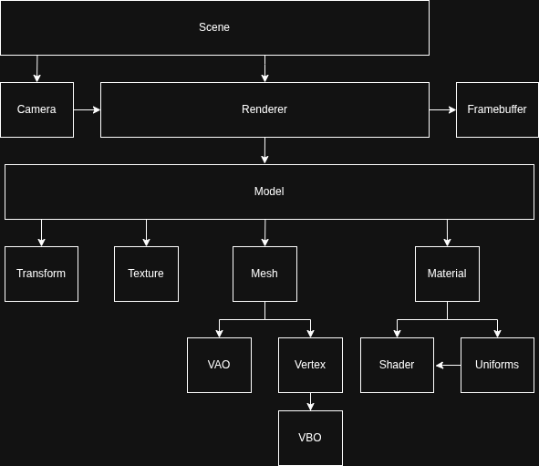

# Design

THIS DOCUMENT IS JUST A SKETCH AND NEEDS TO BE UPDATED

Game engines are complex pieces of software. They provide some way to
define logic, render graphics, and access system resources like audio
and input, as well as providing a corss-platform interface.

Brenta engine is divided in subsystems, each one has different
responsibilities and provides certain abstractions. The most important
subsystems are the rendering, which manages things like models and
textures, and the entity component system which manages logic.

## Renderer

Here is an high-level overview of the most important objects in the
renderer sunsystem:

You will use these abstractions to represent the graphical scene.

## Ecs

