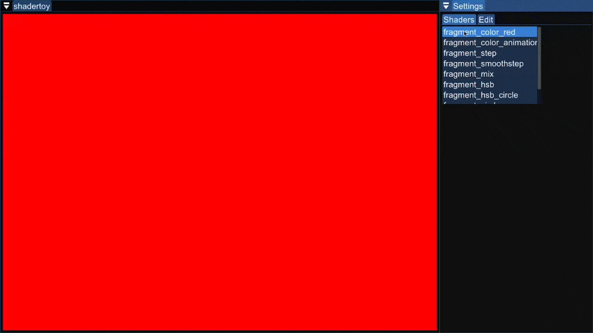
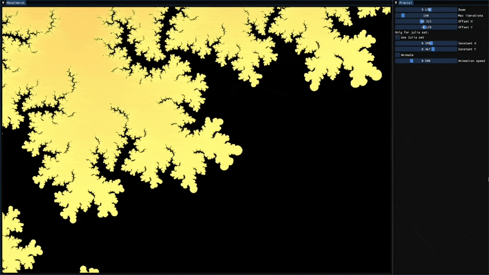
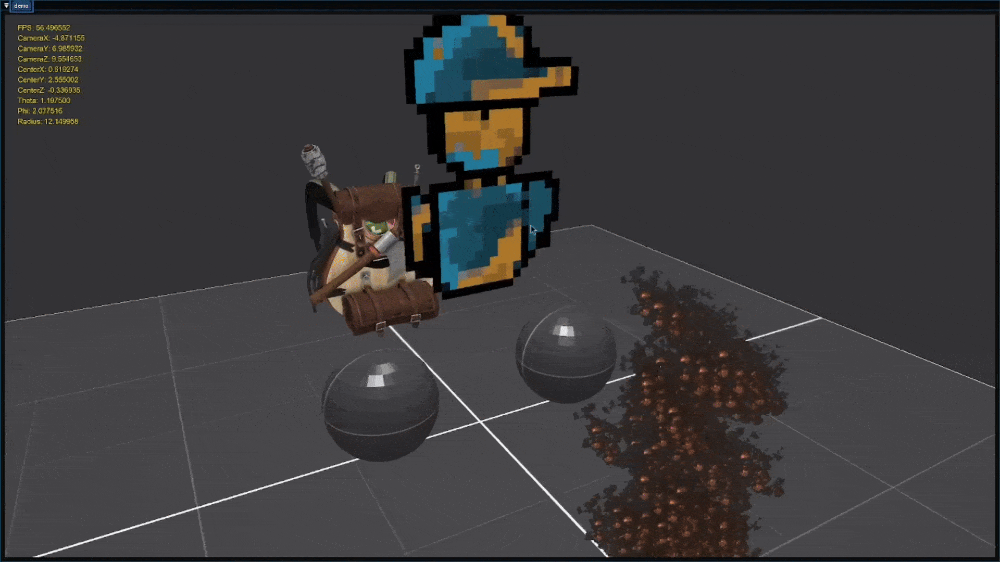

Brenta Engine is a simple 3D engine written in modern C++/OpenGL using
an hibrid scene-graph and Entity Component System architecture. The
engine was created by Giovanni Santini in the summer of 2024, the name
is inspired by the Brenta Dolimites in the Italian Alps.

```c++
#include <brenta/brenta.hpp>

int main()
{

  // Setup
  
  Engine::Builder()
    .with(Logger::Builder()
          .level(oak::level::debug))
    .with(Window::Builder()
          .title("load opengl test")
          .width(screen_width)
          .height(screen_height))
    .build();
  auto engine = Engine::managed();

  // Loop
  
  while (!Window::should_close())
  {
    if (Window::is_key_pressed(Key::Escape))
      Window::close();
    
    // Update logic...
    // Draw...
    Gl::set_color(Color::grey());
    Gl::clear();

    Window::poll_events();
    Window::swap_buffers();
  }
  return 0;
}
```

## Demos

examples/shadertoy.cpp:



examples/mandelbrot-set.cpp:



examples/logger.cpp:

```plaintext
$ ./build/logger 
[ level=info ] logger: set log file to /tmp/brenta_logs
[ level=info ] logger: initialized
[ level=info ] window: set context to OpenGL version: 3.3
[ level=info ] window: set OpenGL profile to core
[ level=info ] window: disabled MSAA
[ level=info ] window: disabled VSync
[ level=info ] window: mouse capture disabled
[ level=debug ] window: set framebuffer size callback
[ level=info ] window: initialized
[ level=info ] gl: enabled GL_DEPTH_TEST
[ level=info ] gl: enabled GL_BLEND (transparency)
[ level=info ] gl: enabled GL_CULL_FACE
[ level=info ] gl: enabled GL_MULTISAMPLE
[ level=info ] gl: initialized
[ level=info ] engine: initialized
[ level=info ] Hello, World!
[ level=info ] gl: terminated
[ level=info ] window: terminated
```

examples/demo/src/main.cpp:



## The subsystems

The Engine is composed of several subsystems:

* **[viotecs](https://github.com/San7o/viotecs)**: Entity Component
System
- **[oak](https://github.com/San7o/oak)**: engine logger
- **[valfuzz](https://github.com/San7o/valFuzz)**: testing
framework
- **brenta::window**: manages the window and the OpenGL context.
- **brenta::audio**: everything audio.
- **brenta::input**: manages the screen input using callbacks.
- **brenta::text**: text rendering.
- **brenta::engine**: manages the setup of the engine.

Additionally, the engine provides multiple classes for various
functionalities such as wrappers around opengl primitives, or managing
the camera or the time. Classes often provide a `Builder` to initalize
them nicely.

## License

The engine is released under the MIT license.
